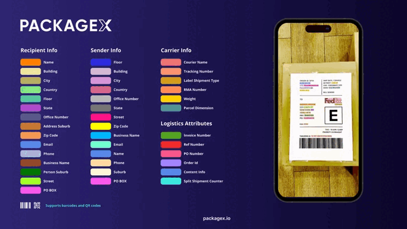

# VisionSDK iOS Integration

Barcode and QR Code scanner framework for iOS. VisionSDK provides a way to detect barcodes and qr codes with both manual
and auto capturing modes. It also provides OCR for text detection in offline(without internet) and online(label scanning
with Restful API) modes. Written in Swift.



## Development Requirements

- iOS 15.0+
- Swift: 5.7
- Xcode Version: 13.0

## Installation

### CocoaPods

[CocoaPods](https://cocoapods.org) is a dependency manager for Cocoa projects. For usage and installation instructions,
visit their website. To integrate VisionSDK into your Xcode project using CocoaPods, specify it in your `Podfile`:

```ruby
pod 'VisionSDK'
```

```swift
import VisionSDK
```

## Usage

### Add `Privacy - Camera Usage Description` to Info.plist file


### Initialization

In order to use the OCR API, you have to set Constants.apiKey to your API key. Also, you also need to specify the API
environment that you have the API key for. Please note that these have to be set before using the API call. You can
generate your own API key at [cloud.packagex.io](https://cloud.packagex.io/auth/login). You can find the instruction
guide [here](https://docs.packagex.io/docs/getting-started/welcome).

```swift
Constants.apiKey = "your_api_key"
Constants.apiEnvironment = .staging
```

### The Basis Of Usage

```swift
import VisionSDK
import AVFoundation

final class ViewController: UIViewController {
    override func viewDidLoad() {
        super.viewDidLoad()
        setupScanner()
    }

    private func setupScanner() {
        switch AVCaptureDevice.authorizationStatus(for: .video) {
        case .authorized:
            setupScannerView()
        case .notDetermined:
            AVCaptureDevice.requestAccess(for: .video) { [weak self] granted in
                if granted {
                    DispatchQueue.main.async { [weak self] in
                        self?.setupScannerView()
                    }
                }
            }
        default:
            showAlert()
        }
    }

    private func setupScannerView() {
        let scannerView = CodeScannerView(frame: view.bounds)
        view.addSubview(scannerView)

        scannerView.configure(delegate: self, sessionPreset: .high, captureMode: .auto, captureType: .single, scanMode: .autoBarCodeOrQRCode)
        
        
        //Please note that if you want default settings then you can ignore setting focusSettings, cameraSettings etc.
        
        // You can modify FocusSettings properties if needed
        let focusSettings = CodeScannerView.FocusSettings()
        scannerView.focusSettings = focusSettings
                
        // You can modify focus ObjectDetectionConfiguration properties if needed
        let objectDetectionConfiguration = CodeScannerView.ObjectDetectionConfiguration()
        scannerView.objectDetectionConfiguration = objectDetectionConfiguration
                
        // You can modify focus CameraSettings properties if needed
        let cameraSettings = CodeScannerView.CameraSettings()
        scannerView.cameraSettings = cameraSettings
        
                
        // For price Tag mode you can use this
        let priceTagDetectionSettings = CodeScannerView.PriceTagDetectionSettings()
        scannerView.priceTagDetectionSettings = priceTagDetectionSettings
        
        scannerView.startRunning()
    }

    private func showAlert() {
        DispatchQueue.main.asyncAfter(deadline: .now() + 0.5) { [weak self] in
            let alert = UIAlertController(title: "Error", message: "Camera is required to use in this application", preferredStyle: .alert)
            alert.addAction(.init(title: "OK", style: .default))
            self?.present(alert, animated: true)
        }
    }
}

extension ViewController: CodeScannerViewDelegate {

    func codeScannerView(_ scannerView: CodeScannerView, didFailure error: CodeScannerError) {
        print(error)
    }

    func codeScannerView(_ scannerView: CodeScannerView, didSuccess codes: [String]) {
        print(codes)
    }

    // called when text, barcode, or qr code is detected in camera stream, Depends on configuration of scanner view in ObjectDetectionConfiguration e.g. isTextIndicationOn, isBarCodeOrQRCodeIndicationOn
    func codeScannerViewDidDetect(_ text: Bool, barCode: Bool, qrCode: Bool, document: Bool) {
        
    }

    // returns captured image with all barcodes detected in it, cropped image only if document is detected in the image
    func codeScannerView(_ scannerView: VisionSDK.CodeScannerView, didCaptureOCRImage image: UIImage, withCroppedImge croppedImage: UIImage?, withbarCodes barcodes: [String]) {
    
    }

    // This function is called only in Price Tag mode and requires boolean return value to display verification success on camera view. Please note that .priceTag mode works only if you are authenticated user. For authentication, use VisionAPIManager.checkPriceTagAuthenticationWithKey method
    func codeScannerViewDidCapturePrice(_ price: String, withSKU sKU: String) -> Bool {
        
    }
}
```

### Customization

#### Source Code Way

```swift
override func viewDidLoad() {
        super.viewDidLoad()

        let scannerView = CodeScannerView(frame: view.bounds)
        
        scannerView.setScanModeTo(.barcode)
        scannerView.setCaptureTypeTo(.multiple)
        scannerView.setCaptureModeTo(.manual)
        
}
```

#### Interface Builder Way

|Setup Custom Class|
|-|


## Functional Description

### Static Properties

- `videoDevice: AVCaptureDevice` - It is the video device that is being used by the CodeScannerView. Camera zoom, torch or other device based operations must be carried out on this property. It can be accessed using `CodeScannerView.videoDevice` syntax


### Configuration Methods

```swift

scannerView.configure(delegate: VisionSDK.CodeScannerViewDelegate, sessionPreset: AVCaptureSession.Preset = .high, captureMode: VisionSDK.CaptureMode = .auto, captureType: VisionSDK.CaptureType = .single, scanMode: VisionSDK.CodeScannerMode = .qrCode)

```

#### Parameters

- `delegate` - Should be the class that confirms to the `CodeScannerViewDelegate` protocol
- `FocusSettings` - FocusSettings struct defines the focus related properties of scanner view. These properties are:

    - `focusImage: UIImage?` - Image to be displayed in the centre if the view. If not provided, VisionSDK will use the
      default image. Note that focus rectangle frame is subject to change with respect to different scan modes.
      
    - `focusImageRect: CGRect` - Custom rect for the focus image. You can provide your preferred rect or use .zero for default. Note that default focus rectangle frame is subject to change with respect to different scan modes.

    - `shouldDisplayFocusImage: Bool` - set true if you need focused region to be drawn.

    - `shouldScanInFocusImageRect: Bool` - set true if you want to detect codes visible in focused region only. This will discard the codes detected to be outside of the focus image. This applies only in barcode, qr and autoBarCodeOrQRCode modes.
    
    - `showCodeBoundariesInMultipleScan: Bool` - set true if you want to display boundaries around detetcted codes in multiple code scan. Default value is 'true'
    
    - `validCodeBoundryBorderColor: UIColor` - Color of border drawn around detected valid code. Default value is '.green'
        
    - `validCodeBoundryBorderWidth: CGFloat` - Width of border drawn around detected valid code. Default value is '1.0'
            
    - `validCodeBoundryFillColor: UIColor` - Fill color of border drawn around detected valid code. Default value is '.green.withAlphaComponent(0.3)'
    
    - `inValidCodeBoundryBorderColor: UIColor` - Color of border drawn around detected invalid code. Default value is '.red'
        
    - `inValidCodeBoundryBorderWidth: CGFloat` - Width of border drawn around detected invalid code. Default value is '1.0'
            
    - `inValidCodeBoundryFillColor: UIColor` - Fill color of border drawn around detected invalid code. Default value is '.red.withAlphaComponent(0.3)'
      
    - `showDocumentBoundries: Bool` - Set true if you want to display boundaries around document detected in camera view.

    - `documentBoundryBorderColor: UIColor` - Set the border color of boundaries drawn around detected document in camera stream.
      
    - `documentBoundryFillColor: UIColor` - Set the fill color of boundaries drawn around detected document in camera stream.
      
    - `focusImageTintColor: UIColor` - Set the color you want the focus image to be displayed in when no code is detected.
      
    - `focusImageHighlightedColor: UIColor` - Set the color you want the focus image to be displayed in when code is detected.
      
- `ObjectDetectionConfiguration` - ObjectDetectionConfiguration struct defines the object detection properties of scanner view. These properties are:

    - `isTextIndicationOn: Bool` - Set false if you do not want to detect text in live camera feed. If set
      false `codeScannerViewDidDetect(_ text: Bool, barCode: Bool, qrCode: Bool, document: Bool)` method will send `text` parameter as
      false.

    - `isBarCodeOrQRCodeIndicationOn: Bool` - Set false if you do not want to detect bar codes or qrcodes in live camera
      feed. Using this proerty my be helpful in cases if you want to perform manual capture based on code detection.
      
    - `isDocumentIndicationOn: Bool` - Set false if you do not want to detect document in live camera feed.

    - `codeDetectionConfidence: Float` - You can set the minimum confidence level for codes detected. Those below the given value will be dicarded. Value must be set on the scale of 0 - 1. Default is `0.5`.
      
    - `documentDetectionConfidence: Float` - You can set the minimum confidence level for document detection. Those below the given value will be dicarded. Value must be set on the scale of 0 - 1. Default is `0.9`.
      
    - `secondsToWaitBeforeDocumentCapture: Double` - Time threshold to wait before capturing a document automatically in OCR mode. VisionSDK only captures the document if it is continuously detected for the n(value of this property) seconds. Default is `3.0`.
    
    - `selectedTemplateId: String?` - Set this value using the template id if you want to detect multiple codes using a specific template. To use a specific template, set the captureType to .multiple as well.

- `CameraSettings` - CameraSettings struct defines the camera related properties of scanner view. These properties are:

    - `nthFrameToProcess: Int` - This is the nth number of the frame that is processed for detection of text, barcodes,
      and qrcodes in live camera feed if enabled by `isTextIndicationOn` or `isBarCodeOrQRCodeIndicationOn`. Processing
      every single frame may be costly in terms of CPU usage and battery consumption. Default value is `10` which means
      that from camera stream of usual 30 fps, every 10 frame is processed. Its value should be set between 1 - 30.
      
- `PriceTagDetectionSettings` - PriceTagDetectionSettings struct defines the price tag related properties of scanner view. These properties are:

    - `shouldDisplayOnScreenIndicators: Bool` - Set true if you want to display price tag verification indicators on screen after detection.

    - `validTagImage: UIImage` - Set the image you want to be dispayed on camera stream when a price tag has been detected and verified as valid.

    - `invalidTagImage: UIImage` - Set the image you want to be dispayed on camera stream when a price tag has been detected and is invalid.
      
- `captureMode` - Defines whether the VisionSDK should capture codes automatically or not. If you want to capture
      code on user action, then set it to `.manual`. Default value is `.auto`. If otherwise, you will have to manually
      trigger scanning using `capturePhoto()` method.

- `captureType` - Set it to `.multiple` if you want to allow multiple results from scan. In `.manual` case, you will
      have to manually trigger scanning using `capturePhoto()` method.
 
- `scanMode` - Defines the scan mode. It has following options
    - `.barCode` - Detects barcodes only in this mode
    - `.qrCode` - Detects qr codes only in this mode
    - `.autoBarCodeOrQRCode` - Detects both bar codes and qr codes
    - `.ocr` - Use this mode to capture photos for later user in OCR API call.
    - `.photo` - Use this mode to capture regular photos without the need for OCR
    - `.priceTag` - Use this mode for scanning price tags. This mode is only available for authenticated users.

```swift

scannerView.setScanModeTo(_ mode: VisionSDK.CodeScannerMode)

```

Sets the scan mode to desired mode.

```swift

scannerView.setCaptureModeTo(_ mode: VisionSDK.CaptureMode)

```

Sets the capture mode to desired mode.

```swift

scannerView.setCaptureTypeTo(_ type: VisionSDK.CaptureType)

```

Sets the capture type to desired type.

```swift

scannerView.startRunning()

```

Needs `configure()` method to be called before it. It starts the camera session and scanning.

```swift

scannerView.stopRunning()

```

Stops camera session and scanning.

```swift

scannerView.rescan()

```

Use this function to resume scanning

```swift

scannerView.deConfigure()

```

Removes all the configurations of scannerView and stops scanning.

```swift

scannerView.capturePhoto()

```

Use this method to trigger code scan or photo capture when you are scanning for multiple codes, in manual capture, OCR, or Photo
mode.

### Delegate Methods

```swift

func codeScannerView(_ scannerView: VisionSDK.CodeScannerView, didSuccess codes: [String])

```

This method returns with the codes scanned after successful scan

```swift

func codeScannerViewDidDetect(_ text: Bool, barCode: Bool, qrCode: Bool, document: Bool)

```

This method is called when text, barcode or qr code is detected in the camera stream. Values depend on whether text or
code indication is enabled while configuring the scanner view.

```swift

func codeScannerView(_ scannerView: VisionSDK.CodeScannerView, didCaptureOCRImage image: UIImage, withCroppedImge croppedImage: UIImage?, withbarCodes barcodes: [String], savedImageURL: URL?)

```

This method is called when `capturePhoto()` method is called in OCR or Photo Mode. It return with the captured image from camera stream, all the
detected codes in it, and an optional cropped document image if a document is detected with in the captured image. `savedImageURL` parameter provides with the on device image url if `CameraSettings.shouldAutoSaveCapturedImage` is set to `true` while configuring the scanner view.

```swift

func codeScannerView(_ scannerView: VisionSDK.CodeScannerView, didFailure error: NSError)

```
This method is called when an error occurs in any stage of initializing or capturing the codes when there is none
detected.

```swift

@objc
public enum CodeScannerError: Int {
    case cameraUsageNotAuthorized = 0
    case noTextDetected = 1
    case noBarCodeDetected = 2
    case noQRCodeDetected = 3
    case noBarCodeORQRCodeDetected = 4
    case noDocumentDetected = 5
    case videoUnavailable = 6
    case authenticationNeededForPriceTagScanning = 7
    case priceTagDelegateNotImplemented = 8
    case templateNotFound = 9
    case noTemplateCodesFound = 10
}

```

Please handle the error cases accordingly. `CodeScannerError` cases are given as well. You can use them to track errors thrown.

### Custom Template Scanning Methods

In order to use custom templates for code scanning. It is necessary to create a template first. You can create templates using the following code

```swift

    func openTemplateController() {
    
        let scanController = GenerateTemplateController.instantiate()
        scanController.delegate = self
        
        if let sheet = scanController.sheetPresentationController {
            sheet.prefersGrabberVisible = true
        }
        
        self.present(scanController, animated: true)
    }
    
```

Listen to the `GenerateTemplateControllerDelegate` methods to get response.

```swift

    extension BarcodeViewController: GenerateTemplateControllerDelegate {
    
        // This function provides you with the ID of the template that has been created
        func templateScanController(_ controller: GenerateTemplateController, didFinishWith result: String) {
            print(result)
        }
    
        func templateScanController(_ controller: GenerateTemplateController, didFailWithError error: any Error) {
            controller.dismiss(animated: true)
        }
    
        func templateScanControllerDidCancel(_ controller: GenerateTemplateController) {
            print("Template creation cancelled")
        }
    }
    
```


NOTE: VisionSDK automatically saves created templates into its secure storage. You can access those saved template using methods below

```swift
    
    // This method returns all the ids of the saved templates
    CodeScannerView.getAllTemplates()

    // This method deletes the template with the specified ID
    CodeScannerView.deleteTemplateWithId(_ id: String)
    
    // This method deletes all saved templates
    CodeScannerView.deleteAllTemplates()
    
```

### On-Device OCR Methods

This method must be called first before using offline device OCR. Preparation should complete first without any errors. For that, listen to completion block in the params.

```swift

    // This method must be provided with `apiKey` or `token`.
    // modelClass: VSDKModelClass - Select required Model Class. Currently supported is .shippingLabel only
    // modelSize: VSDKModelSize - Select the model size for the above selected Model Class. Currently supported sizes are .micro and .large only.
    
    func prepareOfflineOCR(withApiKey apiKey: String? = nil, andToken token: String? = nil, forModelClass modelClass: VSDKModelClass, withModelSize modelSize: VSDKModelSize = .micro, withProgressTracking progress: ((_ currentProgress: Float, _ totalSize: Float)->())?, withCompletion completion:((_ error: NSError?)->())?)

```    

For extraction of data using Offline OCR use the following method.

```swift

    func extractDataFromImage(_ image: CIImage, withBarcodes barcodes: [String], _ completion: @escaping ((Data?, NSError?) -> Void))

```   

It returns with the OCR Response based on PackageX Platform API [Response](https://docs.packagex.io/docs/scans/models).
 
These methods are called on the shared instance of `OnDeviceOCRManager`. It can be accessed using `OnDeviceOCRManager.shared`
syntax.
    
### OCR Methods

```swift

func checkPriceTagAuthenticationWithKey(_ apiKey: String?, _ completion: @escaping ((_ error: NSError?) -> Void))

func callScanAPIWith(_ image: UIImage, andBarcodes barcodes: [String], andApiKey apiKey: String? = nil, andToken token: String? = nil, andLocationId locationId: String? = nil, andOptions options: [String: String], withImageResizing shouldResizeImage: Bool = true, _ completion: @escaping ((_ data: Data?, _ response: URLResponse?, _ error: NSError?)-> Void))

func callManifestAPIWith(_ image: UIImage, andBarcodes barcodes: [String], andApiKey apiKey: String? = nil, withImageResizing shouldResizeImage: Bool = true, _ completion: @escaping ((_ data: Data?, _ response: URLResponse?, _ error: NSError?) -> Void))

```

These methods are called on the shared instance of `VisionAPIManager`. It can be accessed using `VisionAPIManager.shared`
syntax. 

To use price tag scanning, you need to authenticate first using `checkPriceTagAuthenticationWithKey` method. Upon successful completion block calling without error, you can use price tag mode of scanner view.

`callScanAPIWith` method recieves the captured image and the API Key or AuthToken as parameters. It returns with the OCR Response from
PackageX Platform API [Response](https://docs.packagex.io/docs/scans/models).

`callManifestAPIWith` method recieves the captured image and the API Key as parameters.


# VisionSDK Android Integration

The VisionSDK Android Integration is a barcode and QR code scanner framework for Android that
provides a simple and efficient way to detect barcodes and QR codes in both manual and
automatic capturing modes. It also includes AI capabilities to extract information from logistic
documents.

Some key features of the VisionSDK Android Integration include:

- Barcode and QR code scanning
- Focus on a specific area of camera preview
- Document detection
- Capturing of image
- Information extraction from logistic documents (via both local ML models (offline) and REST API)
    - Shipping Label
    - Bill of Lading
    - Item Label
    - Document Classification

## Installation
Vision SDK is hosted on JitPack.io

First add JitPack to your root project

```kotlin
maven { url = uri("https://jitpack.io") }
```

Then add the following dependency to
your project's build.gradle file:

```kotlin
implementation ("com.github.packagexlabs:vision-sdk-android:v2.0.18")
```
Check the [latest version](https://jitpack.io/#packagexlabs/vision-sdk-android) here

## Usage

### Initialization

In order to use the OCR API, you have to set Constants.apiKey to your API key. Also, you also need to specify the API
environment that you have the API key for. Please note that these have to be set before using the API call. You can
generate your own API key at [cloud.packagex.io](https://cloud.packagex.io/auth/login). You can find the instruction
guide [here](https://docs.packagex.io/docs/getting-started/welcome).

Initialise the SDK first:

There are 2 ways for authentication
1. Via API key
2. Via Token

```kotlin
VisionSDK.getInstance().initialize(
   context = this,
   environment = Environment.SANDBOX
)
```


### Basic Usage

Set initial setting/configurations of the camera:

```kotlin
visionCameraView.configure(
   detectionMode = DetectionMode.Barcode OR DetectionMode.QRCode OR OR DetectionMode.BarcodeOrQRCode OR DetectionMode.OCR,
   scanningMode = ScanningMode.Manual OR ScanningMode.Auto,
   isMultipleScanEnabled = true OR false
)

visionCameraView.setFlashTurnedOn( true OR false )

visionCameraView.setObjectDetectionConfiguration(
   ObjectDetectionConfiguration(
      isTextIndicationOn = true,
      isBarcodeOrQRCodeIndicationOn = true,
      isDocumentIndicationOn = true,
      secondsToWaitBeforeDocumentCapture = 3
   )
)

// Optional
visionCameraView.setCameraSettings(
   CameraSettings(
      nthFrameToProcess = -1 OR 10 OR any integer number
   )
)

// Optional
if (visionCameraView.isCameraStarted()) {
   visionCameraView
      .getFocusRegionManager()
      .setFocusSettings(screenState.focusSettings)
}
```

To start scanning for barcodes, QR codes, text or documents, use the startCamera method after it is initialized. See the code below for example:

```kotlin
private fun startScanning() {

    visionCameraView.setScannerCallback(object : ScannerCallback {

      fun onIndications(barcodeDetected: Boolean, qrCodeDetected: Boolean, textDetected: Boolean, documentDetected: Boolean) {

      }

      fun onCodesScanned(barcodeList: List<String>) {

      }

      fun onFailure(exception: ScannerException) {

      }

      fun onImageCaptured(bitmap: Bitmap, value: List<String>) {
         // bitmap: The bitmap of captured image
         // imageFile: Optional image file if user requested the image to be saved as file also.
         // value: List of barcodes that were detected in the given image.
      }
    })

    visionCameraView.setCameraLifecycleCallback(object : CameraLifecycleCallback {
      override fun onCameraStarted() {
          // If you want to apply Focus Settings, you can do that here, after camera is started.
          // Optional
          visionCameraView
            .getFocusRegionManager()
            .setFocusSettings(focusSettings = FocusSettings())
      }
      override fun onCameraStopped() {}
    })

    visionCameraView.startCamera()
}
  ```

Note that, once `onBarcodesDetected` or `onImageCaptured` callbacks are called, VisionSDK will stop analysing camera feed for text or barcodes/QR codes.
This is to prevent extra processing and battery consumption. When client wants to start analysing camera feed again, after consuming the results of previous scan, client needs to call the following function:

```kotlin
visionCameraView.rescan()
```

### Zoom Options
After camera is started, client can request all the zoom levels and can set zoom in camera. There are two ways to set zoom.
#### Linear Zoom
```kotlin
val zoomLevel = 0.0F // Linear zoom levels range from 0.0F to 1.0F
visionCameraView.setLinearZoom(zoomLevel)
```
#### Ratio Zoom
```kotlin
// Ratio zoom levels range from visionCameraView.getMinZoomRatioAvailable() to visionCameraView.getMaxZoomRatioAvailable()
val minZoomRatio = visionCameraView.getMinZoomRatioAvailable()
val maxZoomRatio = visionCameraView.getMaxZoomRatioAvailable()

visionCameraView.setZoomRatio(1.0F OR any Float between minZoomRatio or maxZoomRatio)
```

#### Scanning Modes

There are 2 types of scanning mode

1. `Auto` mode will auto-detect any Barcode or QR code based on the detection mode
2. `Manual` mode will detect Barcode or QR code upon calling `visionCameraView.capture()`

#### Detection Modes

Detection mode is used to specify what the user is trying to detect

1. `Barcode` detects only barcode
2. `QRCode` detects only QR codes
3. `OCR` for OCR detection. This mode will capture an image for the user. User can then decide to extract logistic data from it using either API call or on-device OCR capabilities.
4. `Photo` is used to take images without any processing

### Trigger Manual Capture

As mentioned above that we have a manual mode. For manual mode trigger, you can call `visionCameraView.capture()`,
based on the mode
it will be giving different callbacks

If detection mode is

1. `DetectionMode.Barcode` then it will trigger the `onBarcodeDetected` callback in case of barcode detection or throw an exception.
2. `DetectionMode.QRCode` will return QR code or throw exception.
3. `DetectionMode.OCR` will capture an image along with the current barcode and return in `onImageCaptured`

> __Make sure that when calling capture, scan mode should be manual__

#### Capturing image:

You can capture an image when mode is OCR. In OCR mode when `capture` is called, then in the callback,
it will return an image.

```kotlin
visionCameraView.capture()
```

```kotlin
fun onImageCaptured(bitmap: Bitmap, imageFile: File?, value: List<String>) {
   //Image along with the barcodes
}
```

In the callback, it will return the image bitmap along with the barcodes list in the current frame.

### Making OCR Call:

To make an API call, first thing that the user needs to make sure is that `VisionSDK` is initialized. See [Initialization](#initialization) for details.

Once the user has successfully initialized `VisionSDK`, the they can use class `ApiManager` for making API calls.

Following are the APIs that are available for our users through VisionSDK:
1. Shipping Label (both online and on-device)
2. Bill of Lading (only online)
3. Item Label (both online and on-device)
4. Document Classification (both online and on-device)

Logistic information can be extracted from image in these two contexts. Users can post these images using the following suspended functions from `ApiManager` class.

#### Shipping Label
```kotlin
val jsonResponse = ApiManager().shippingLabelApiCallSync(
   apiKey = "YOUR_API_KEY_HERE", // You only need to pass one of the two params (apiKey or token)
   token = "YOUR_TOKEN_HERE",
   bitmap = bitmap,
   barcodeList = list,
   locationId = "OPTIONAL_LOCATION_ID",
   recipient = mapOf(
      "contact_id" to "CONTACT_ID_HERE"
   ),
   sender = mapOf(
      "contact_id" to "CONTACT_ID_HERE"
   ),
   options = mapOf(
      "match" to mapOf(
         "search" to listOf("recipients"),
         "location" to true
      ),
      "postprocess" to mapOf(
         "require_unique_hash" to false
      ),
      "transform" to mapOf(
         "tracker" to "outbound",
         "use_existing_tracking_number" to false
      )
   ),
   metadata = mapOf(
      "Test" to "Pass"
   )
)
```

#### Bill of Lading
```Kotlin
val jsonResponse = ApiManager().manifestApiCallSync(
   apiKey = "YOUR_API_KEY_HERE", // You only need to pass one of the two params (apiKey or token)
   token = "YOUR_TOKEN_HERE",
   bitmap = bitmap,
   barcodeList = list
)
```

#### Item Label
```Kotlin
val jsonResponse = ApiManager().itemLabelApiCallSync(
   apiKey = "YOUR_API_KEY_HERE", // You only need to pass one of the two params (apiKey or token)
   token = "YOUR_TOKEN_HERE",
   bitmap = bitmap
)
```

#### Document Classification
```Kotlin
val jsonResponse = ApiManager().documentClassificationApiCallSync(
   apiKey = "YOUR_API_KEY_HERE", // You only need to pass one of the two params (apiKey or token)
   token = "YOUR_TOKEN_HERE",
   bitmap = bitmap
)
```

### Making On-Device Call (usage without internet):

You need internet to download the important files for the first time. These files are used for processing and extracting data from the images.
In order to do that, you need to use `configure()` function of the class `OnDeviceOCRManager`.

```kotlin
val onDeviceOCRManager = OnDeviceOCRManager(
   context: Context,
   platformType: PlatformType,
   modelClass: ModelClass,
   modelSize: ModelSize
)
```

`PlatformType` is an enum with following values:
```kotlin
Native // For Android native apps
Flutter // For Flutter apps
ReactNative // For React Native apps
```

`ModelClass` is an enum that is used to inform the VisionSDK of the kind of OCR capabilities you require in your app.
Following are its option:
```kotlin
ShippingLabel
BillOfLading
ItemLabel
DocumentClassification
```

`ModelSize` is another enum (an optional parameter here) that is used to inform the VisionSDK about the type of files that it should download. Following are the types of model:
```kotlin
Nano
Micro
Small
Medium
Large
XLarge
```

### On-Device Options Currently Available

| Model Class            | Nano | Micro | Small | Medium | Large | XLarge |
|------------------------|------|-------|-------|--------|-------|--------|
| ShippingLabel          | X    | ✓     | X     | X      | ✓     | X      |
| BillOfLading           | X    | X     | X     | X      | X     | X      |
| ItemLabel              | X    | X     | X     | X      | ✓     | X      |
| DocumentClassification | X    | X     | X     | X      | ✓     | X      |

After creating the instance of `OnDeviceOCRManager`, you need to call its `configure()` function. This suspend function will download the important files, if needed, and then load them in memory.

```kotlin
onDeviceOCRManager.configure(
   executionProvider: ExecutionProvider = ExecutionProvider.NNAPI,
   progressListener: ((Float) -> Unit)? = null
)
```

`ExecutionProvider` parameter is optional and usually the default value works fine.

The `progressListener` (also optional) parameter can be used to track the progress of downloading and loading of files. Its value is from 0.0 to 1.0.

After configuring it successfully, you need to call the function `getPredictions()` and pass it the bitmap of the image you want to perform OCR operations on and list of barcodes to try to extract information using regex.

```kotlin
onDeviceOCRManager.getPredictions(bitmap: Bitmap, barcodes: List<Barcode>): String
```

The result of `getPredictions()` function is a JSON response in `String` form.

Once you are done with the `OnDeviceOCRManager`, make sure that you destroy its instance by calling the following method:

```kotlin
onDeviceOCRManager.destroy()
```

## Report an issue
VisionSDK contains internal error reporting mechanism if it faces any issue. 
Furthermore, if you get a response from On-Device models, that you consider to be incorrect, then you can report it using the following function:
```kotlin
val reportResult: ReportResult = ApiManager().reportAnIssueSync(
   context: Context,
   apiKey = "YOUR_API_KEY_HERE", // You only need to pass one of the two params (apiKey or token)
   token = "YOUR_TOKEN_HERE",
   platformType: PlatformType = PlatformType.Native,
   modelClass: ModelClass,
   modelSize: ModelSize,
   report: String,
   customData: Map<String, Any?>? = null,
   base64ImageToReportOn: String? = null
)
```

## Attribution
https://www.flaticon.com/free-icon/browser_9892390?term=template&page=1&position=10&origin=search&related_id=9892390

## License

Copyright © 2024 PackageX Labs.

Licensed under the MIT License.


